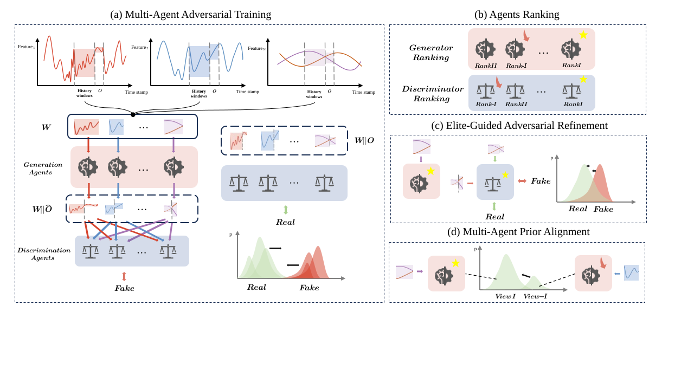

# MAA
<p>Code base of 
    <span style="color:#2E8B57;">M</span>ulti- 
    <span style="color:#1E90FF;">A</span>gent 
    <span style="color:#8B0000;">A</span>dversarial
    <span style="color:#FF8C00;">T</span>ime 
    <span style="color:#FFD700; background-color:black;">S</span>eries
    <span style="color:#800080;">F</span>orecasting
    (MAA-TSF)
</p>

## A biref intro of GCA:

A class inherit structure:

```
MAAbase
 | 
 | -- MAA time series
 | -- MAA {image} generation 
 | -- ... {more other generation tasks}
```

## Overall paradigm


## Brief Intro
### Initialize models: 
- N generators, e.g. [GRU LSTM, Transformer]  # 3 generator models
- N discriminators, e.g. [CNND1, CNND2, CNND3]  # 3 discriminator models

- Generators use past window size to predict next 1 (to N maybe will realize in the future version) timestamp.
- Discriminators use past window size concatting predict label to discriminate and adversarial train

### Main loop: 
Now following are the present code logic. (Please point out if there exists any faults)
``` 
FOR e in EPOCHS: 
  # Main training loop
  # 1. Individual pre-training
  for generator in generators:
      train(generator, loss_fn=MSE, Cross Entropy)  # Train each generator separately with MSE loss
      
  for discriminator in discriminators:
      train(discriminator, loss_fn=ClassificationLoss)  # Train each discriminator with classification loss (0: no change, 1: up, -1: down)

  while e % k ==0: 
    # 2. Intra-group evaluation and selection
    best_generator = evaluate_and_select_best(generators, validation_data)
    best_discriminator = evaluate_and_select_best(discriminators, validation_data)
      
    # 3. Intra-group knowledge distillation
    distill(best_generator, worst_generator)
     
    # 4. Cross-group competition
    FOR e0 in k0: 
      adversarial_train(best_generator, best_discriminator)
      if not converge: 
        break
```

## 

